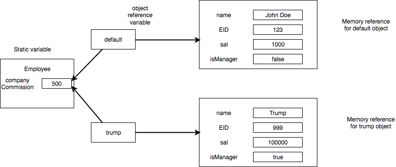

## Methods

Functions are called as methods in Java and perform a certain set of tasks whose implementation is provided by the user. For our Employee example, there were many methods like - setSal, getSal, setCommission, etc. Most methods have the following format

	<*access specifier*> <*return type*> <*method name*> <*parameter list*>

For eg. in our case,

```
public void setSal(double newSal){	// header of method
		this.sal = newSal; // implementation of method from here onwards
	}
```

*	the return type specifier what value is to be returned (like int, double,etc.). For our case, we do not want to return a value but 
	we just want to change the value of salary to a new value hence we return "void" i.e. nothing

*	the parameter list specifies the arguments we provide. For our case, we provided double newSal

### Method Types

*	###Constructors

A constructor method creates an object of a class. A constructor will always have the same name as that of the class and does not have a return type. For our case, we had two different constructor, one without parameters and one with parameters. The constructor without parameters is known as a *default constructor*. The one with parameters is known as a *parameterized constructor*. If we dont create a default constructor, Java will automatically create a default empty constructor. All Strings are assigned blanks values, numbers are assigned 0 and booleans are assigned false by the default constructor. 

The following visualization is provided for your understanding



As seen above, both objects share same memory reference to static variable companyCommission

*	###Getters

These methods are also known as accessor methods and are used to return some information regarding the state of the instance variables **without** altering them. For our case, we had the getSal and getCommission methods which returned the salary and commission of each employee

*	###Setters

These methods are also known as mutator methods and generally have void return types i.e. they do not return anything. Their main objective is to change the state of the instance variables. For our case, we had the setSal and setCommission which enabled Employee objects to change the sal value and companyCommission value (however companyCommission could only be changed by a manager)

*	###Overloaded methods

Multiple methods can have the same name but must have different signatures i.e. different parameters. For our case, we had two setSal methods but they had different parameters(either number or type is different). An example of how to use them is 

```
mike.setSal(30000); // mike's salary is now 30000
mike.setSal(30000,0.1) // mike's salary is now 33000

*	###Static methods

Static methods are methods which belong to the entire class and perform operations for the entire class and not just for individual objects. To declare static methods we need to add *static* keyword to our method. Please note that a static method cannot access/utilize an instance variable and it will cause a compilation error. However, static methods are allowed to use static variables. **Objects of the class** can use both static variables(if they are public) and static methods and any change to static variables by Class objects will cause the changes to be reflected across for all objects and the class. As seen in our example, the Employee class used the static method changeCommission to change the value of the static variable companyCommission


