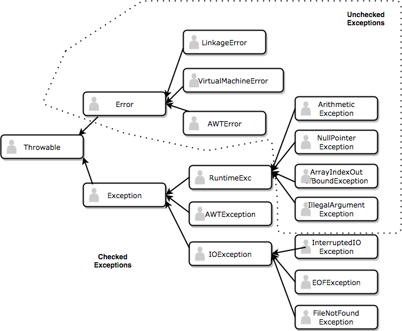

** Exception Handling **

An exception is a special type of error which is produced during run time and not during compile time. What this means is that you will be the compiler will compile your program into bytecode but however it will break down during the execution of the program. For eg. if you divide any integer by 0, you will get a run time error aka exception. Exceptions in Java are classified into two types:

* UnChecked Exceptions
* Checked Exceptions

1. Unchecked Exceptions 
	
	This type of exception is automatically handled by Java's inbuilt exception handler and there is no need to write custom exception handler and program automatically terminates

2. Checked Exceptions

	This type of exception needs to be handled by the user and the user needs to provide code to handle such exceptions

The division of exceptions is as follows



The main exceptions we will be covering for this course are

* Arithmetic Exception 
* NullPointer Exception
* ClassCastException
* ArrayIndexOutOfBoundsException
* IndexOutOfBoundsException
* IllegalArgumentException

As we go through the course, we will be covering all these exceptions one by one in more detail

*** How to handle exception ***

1. Using throw - breaks the execution flow

```
		if(divisor == 0){
			throw new ArithmeticException("Cannot divide by zero");
		}
```

2. Using throws - Used while defining a method to indicate that the method might throw this kind of exception and is useful for handling Checked Exceptions

```
		class Employee{
			public int getSalary() throws MyPersonalException{
				if(salary==0)
					throw MyPersonalException("What kind of job pays 0 salary?");
			}
		}
```


3. Using try catch - try is used to detect sensitive and potential exceptions while catch is used to handle a particular exception if detected within try catch block and provide action to determine outcome of such an exception event. For eg.

```
	int x;
	try{
		 x = 5/0;
	}catch(ArithmeticException ae){
		System.out.print("Cannot be divided by 0");
		x=0;
	}
```

The *final*, The *finally* and The *finalize* - Dont get confused with these!

* final - used to make constants
* finally - used to execute action after try catch block ends whether exception is caught or not
* finalize - method to force manual garbage collection to clean an object when there are no more references to it (Please read more online if you are interested)


