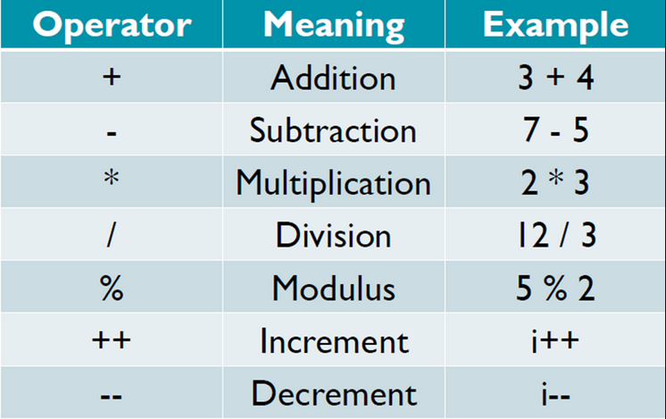
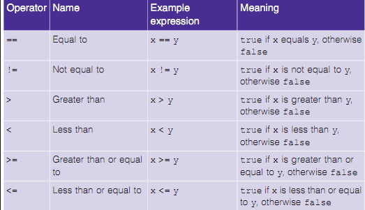
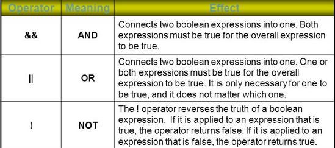
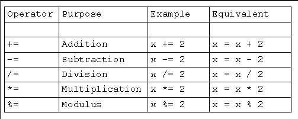

## Operators

Operators are special symbols used in Java to perform certain actions on variables and values. There are 4 main types of operators in Java

	* Arithmetic
	* Logical
	* Relational
	* Assignment

1. *Arithmetic Operators*
	
	These operators are used for mathematical operations as shown in the table below

	

	```
	12/3 = 4
	(double)9/10 = 0.9
	(double)(9/10) = 0 // Why? Because first 9 is divided by 10 which is 0.9 but type int discards numbers succeeding the decimal
	12%5 = 2 // obtain remainer
	-5%2 = -1
	```

	Precedence
	1. () i.e. paranthesis (highest precedence)
	2. *,/,%
	3. +,- (lowest precedence)

2. *Relational Operators*

	Relational operators are used to evaluate checking conditions and return boolean values.

	

	```
	boolean x = (2!=2); // return false
	boolean x = (3 == 3.0) // return true because in this case int is automatically promoted to double value

	y=(x>5)?10:20 // Special ternary operator which takes 3 arguments. It checks if x is greater than 5. If true then y=10 otherwise y=20
	```

3. *Logical Operators*

	Like Relational operators, logical operators also return boolean values

	

	```
	if(x>3 && x<6)    
		do something.  // will only do something if x>3 and also x<6. Both conditions must be true

	if(height>180 || weight<150)
		do something // will only do something if height>180 or weight<150. Either condition must be true

	if(!found)
		do something // will only do something if the value of found is equal to false

4. *Assignment Operators*

	Assignments operators are used to assign and manipulate values of variables 

	

	```
	x=4;
	x+=4; // new value of x is 8
	int a,b,c
	a=b=c=0; // assingnment form right to left i.e. first c is assigned to 0, then b=c (which is 0) and then a=b(which is 0)

	i++ // increment operator . same as writing i=i+1 
	i-- // decrement operator . same as writing i=i-1


