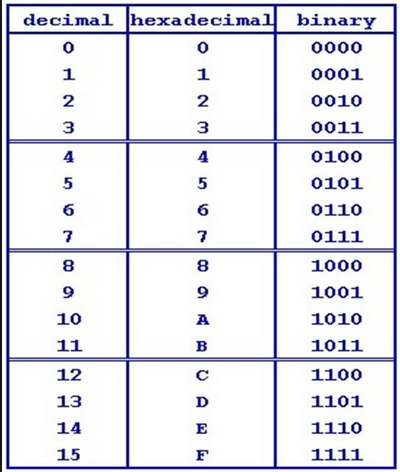

## Types and Identifiers

### Identifier

An identifier is the name for which identifies a entity in Java (i.e. a variable, parameter, constant, method or even a class). The rules for an identifier are

	*	It cannot begin with a digit
	*	It is case sensitive (number is not the same as Number)
	*	It cannot be the same as a predefined keyword (for eg. cannot be int, this, boolean, etc.)

There are different data types of variables which Java allows us to declare which are
	
	1.	int - Whole number integers . For eg. -2, 5,1000
	2.	double - Decimals . For eg. -2.44, 455.124
	3.	boolean - True or False value . true or false only
	4.	float - Floating point value with lesser range than double . For eg., 1.5f, -444.2f (Not to be covered)
	5.	void - empty return type which doesn't return anything. For eg., adding two numbers but not displaying or using the final value


###	 Type Casting

Type Casting is a feature used by Java which allows the compiler to change the data type of variables from one form into another. For eg., to type cast a double value into an int value. The code and their outputs are

```
int a;
double x,y,z,avg;
boolean val;

a= 10;
x= 3.6
y=5.6;
z=3;   // z will be assigned value of 3.00 as it is type double

avg = (x+y)/2;   // value of avg -> 4.6
avg = (int)avg;  // value of avg -> 4
val = false; // will display false
a = (int)val // will have value 0 because in Java when you typecast boolean to int, false is 0 && true is 1
a = (int)x; // need to explicitly type case here to convert from double to int otherwise will cause compile time error
```

### Number Storage

Java uses bits(binary digits) to store integer values. 

#### For type int

	*	Represented by four bytes(or 32 bits)
	*	ranges from (-2^31 to 2^(31)-1)
	*	Integer.MAX_VALUE keyword stores **maximum positive** int value
	*	Integer.MIN_VALUE keyword stores **maximum negative** int value

#### Hex and Octal numbers

	A hexadecimal number is one which uses base 16 for operations and as the name sounds, it has 16 symbols available to it which are from 0-9 and A-F where A represents 10, B represents 11 and so on till the end where F represents 15. It is also represented by a subscript of hex like AF8 (sub)hex(/sub). The conversion table from binary to hex and vice-versa is shown below. Please note that hex is always represented by 4 bits.

	


	```
	5 (hex) = 0101 (bin)
	0 (hex) = 0000 (bin)
	12(hex) = 1100 (bin)

	10110000 (bin) = 1011 0000
				   = B    0 (hex)

	1110010 (bin) = 0111 0010
				  = 7	 2 (hex)

	```

	How to convert from binary to hex? 

		*	Split the number into orders of 4 numbers starting from right to left. (If the number of digits are not in multiples of 4, add  preceding 0's to the left)
		*	Depending on the position of the bit, multiply the value of the bit by 2^(position of the bit) and add all the bits' values. For eg.
			````
			1100 (hex) = 1*2^(3) + 1*2^(2) + 0*2^(1) + 0*2^(0) = 8+4+0+0 = 12 = C (hex)
			```

	How to convert from hex to decimal?

		* Decimal numbers are represented by base 10 and are the usual numbers we use in daily life from 0-9
		* Depending on the position of the hex digit, multiply the value of the bit by 16^(position of the hex digit) and all the hex digits' values. The same is done from octal values but instead it is multiple of 8^(position of the octal digit). **Also note that Octal values range from 0-8** For eg.
			```
			B6(hex) = B*16^(1) + 6*16^(0) = 11*16 + 6*1 = 182 (dec)
			120(oct) = 1*8^(2) + 2*8^(1) + 0*8^(0) = 64 + 16 + 0 = 80 (dec)
			```

## Final variables

	A final variable is a special type of variable used as a constant which takes up one of the defined data types like any other variable but its value can only be defined once and cannot be changed later. **Also note that they are by norm, they are defined in capitals**.

	```
	final int PRICE_TAG;
	PRICE_TAG = 10;
	PRICE_TAG += 5; // will give compilation error
	```


